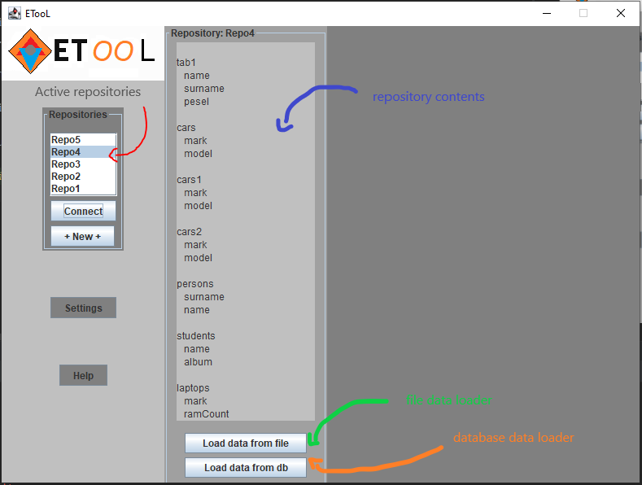

ETooL

 
The application is an implementation of a tool to perform an ETL process and   
load processed data into a data warehouse.

Application is written in java and allows extracting from many source formats   
e.g. .txt, .xml, .csv, .json, as well as databases e.g. oracle database, postgresql and mongodb.

To keep up to date on the issues I'm working on, feel free to take a look [Trello](https://trello.com/b/JbveP8fi/etool).

Currently, the application is reading data from types: txt, csv, json, xml and from postgresql database and loading it into json format repository.

We run the application using the AppRunner class.

Above you can see the main application window.
